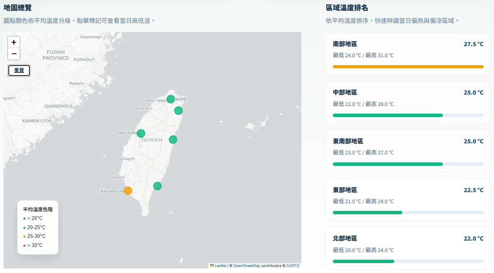

# 114-2 智慧物聯網 HW2

> 中央氣象署農業天氣資料爬取與 Streamlit 視覺化展示專案

這個專案會定期抓取中央氣象署 CWA `F-A0010-001` 相關天氣資料，整理六大區域的最低溫、最高溫與平均溫度，輸出成 `weather_data.csv`，再透過 Streamlit 顯示互動式地圖與資料表。

目前正式部署方式為：

- 前端與展示介面：Streamlit
- 定期更新資料：GitHub Actions 排程自動爬取與提交最新 `weather_data.csv`
- 線上網址：[https://iot2026-weather-hw2-pytree.streamlit.app](https://iot2026-weather-hw2-pytree.streamlit.app)

## 專案內容



- `fetch_weather_data.py`：向 CWA 取得資料並整理成共享快取 `weather_data.csv`
- `app.py`：Streamlit 主程式，負責地圖、卡片與表格顯示
- `weather_service.py`：資料讀取與處理邏輯
- `weather_data.csv`：目前展示使用的共享資料快取
- `.github/workflows/refresh-weather-data.yml`：GitHub Actions 排程更新流程
- `chats/`：本專案開發與調整過程中的聊天紀錄

## 本地執行

### 1. 安裝環境

本專案使用 Python 3.11，依賴套件定義在 `requirements.txt` 與 `pyproject.toml`。

如果你使用 `uv`：

```powershell
uv sync
```

如果你使用 `pip`：

```powershell
python -m venv .venv
.venv\Scripts\Activate.ps1
pip install -r requirements.txt
```

### 2. 設定環境變數

先建立 `.env`：

```powershell
Copy-Item .env.example .env
```

接著在 `.env` 中填入：

```env
CWA_API_KEY=你的中央氣象署 API Key
```

### 3. 先更新資料

```powershell
python fetch_weather_data.py
```

執行後會更新或產生 `weather_data.csv`。

### 4. 啟動 Streamlit

如果你使用 `uv`：

```powershell
uv run streamlit run app.py
```

如果你使用 `pip` 虛擬環境：

```powershell
streamlit run app.py
```

啟動後可在瀏覽器查看本地畫面。

## 目前部署方式

目前這個專案不是由使用者在前端即時觸發爬蟲，而是採用「先更新資料，再部署展示」的模式：

1. GitHub Actions 依照排程執行 `fetch_weather_data.py`
2. 工作流程使用 repository secret `CWA_API_KEY` 取得最新資料
3. 若 `weather_data.csv` 有變化，就自動 commit 回 repository
4. Streamlit 部署端讀取 repo 內最新資料並提供展示

目前排程設定在 [`.github/workflows/refresh-weather-data.yml`](.github/workflows/refresh-weather-data.yml)，每 6 小時自動更新一次，也可以手動執行 `workflow_dispatch`。

## 線上版本

目前部署中的版本位於：

[https://iot2026-weather-hw2-pytree.streamlit.app](https://iot2026-weather-hw2-pytree.streamlit.app)

這個版本會顯示由 GitHub Actions 定期更新後的最新快取資料。

## 聊天記錄

專案相關的聊天記錄都放在 `chats/` 資料夾中，目前包含：

- `chats/00-initial-prompt.md`
- `chats/01-build-first-mvp.md`
- `chats/02-deploy.md`
- `chats/03-ui-optimize.md`

如果要回顧需求演進、部署調整或 UI 優化過程，可以直接查看這個資料夾。
