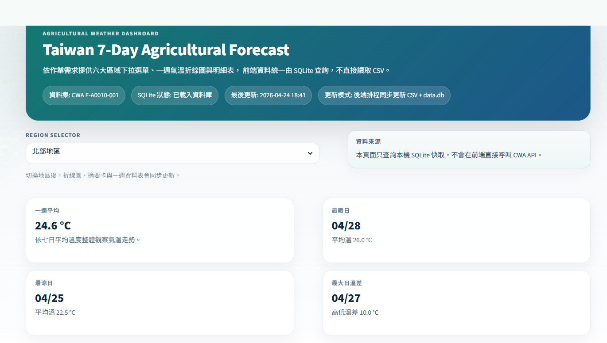
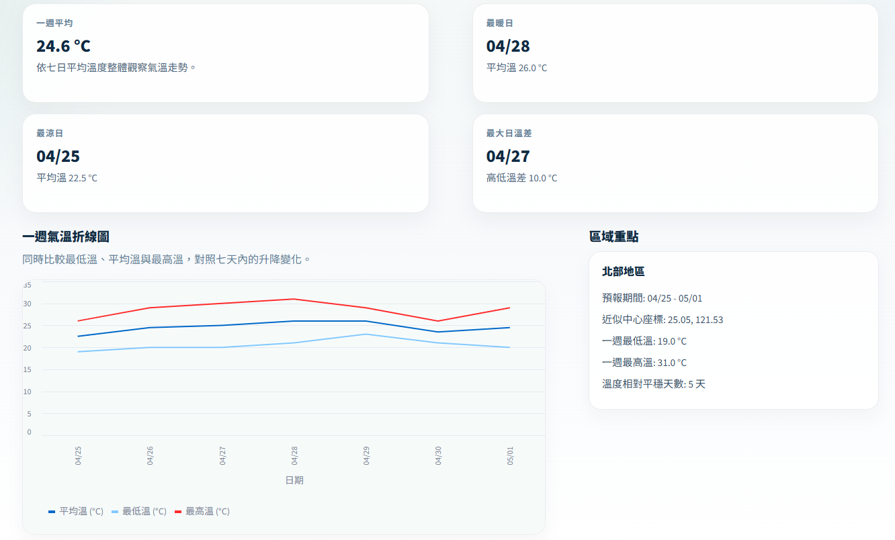

# 114-2 智慧物聯網 HW2

> 中央氣象署農業天氣資料爬取與 Streamlit 視覺化展示專案

這個專案會定期抓取中央氣象署 CWA `F-A0010-001` 相關天氣資料，整理六大區域的最低溫、最高溫與平均溫度，同步輸出成 `weather_data.csv` 與 `data.db`，再透過 Streamlit 顯示作業要求的地區下拉選單、一週折線圖與資料表。

目前正式部署方式為：

- 前端與展示介面：Streamlit
- 定期更新資料：GitHub Actions 排程自動爬取並同步提交最新 `weather_data.csv` / `data.db`
- 線上網址：[https://iot2026-weather-hw2-pytree.streamlit.app](https://iot2026-weather-hw2-pytree.streamlit.app)

## 專案內容





- `fetch_weather_data.py`：向 CWA 取得資料並整理成共享快取 `weather_data.csv` 與 `data.db`
- `app.py`：Streamlit 主程式，負責地區下拉、一週折線圖與資料表顯示
- `weather_service.py`：資料抓取、SQLite 寫入與查詢邏輯
- `weather_data.csv`：保留的 CSV 快取，方便人工檢查或相容用途
- `data.db`：前端正式查詢使用的 SQLite 資料庫
- `.github/workflows/refresh-weather-data.yml`：GitHub Actions 排程更新流程
- `chats/`：本專案開發與調整過程中的聊天紀錄

## HW2 作業檢查清單（2-1 ~ 2-4）

> 以下勾選是依目前 repo 內容對照作業要求整理。

### HW2-1 獲取天氣預報資料（20%）

目的：
使用 CWA API 獲取台灣北部、中部、南部、東北部、東部及東南部地區一週的天氣預報資料（JSON 格式）。

方法：
使用 `requests` 調用 CWA API，並使用 `json.dumps` 觀察獲得的資料。

- [x] 調用 CWA API 獲取天氣預報資料（10%）：`weather_service.py` 會呼叫 CWA `F-A0010-001` 取得資料。
- [x] 觀察獲得的資料（5%）：可使用 `python fetch_weather_data.py --show-json` 透過 `json.dumps` 觀察原始 JSON。
- [x] 程式碼結構與可讀性（5%）：抓取、解析與輸出邏輯集中在 `weather_service.py`，結構已分層。

### HW2-2 分析資料，提取最高與最低氣溫的資料（20%）

目的：
分析天氣預報資料的 JSON 格式，找出最高與最低氣溫的資料位置，並提取出來。

方法：
使用 ChatGPT 或手動分析資料，並使用 `json.dumps` 觀察提取的資料。

- [x] 找出並提取最高與最低氣溫的資料（10%）：`weather_service.py` 已解析 `MinT` / `MaxT` 並整理為最低與最高氣溫欄位。
- [x] 觀察提取的資料（5%）：可使用 `python fetch_weather_data.py --show-extracted` 透過 `json.dumps` 觀察提取後的資料。
- [x] 程式碼結構與可讀性（5%）：提取與整理函式已模組化，便於追蹤資料流。

### HW2-3 將氣溫資料儲存到 SQLite3 資料庫（20%）

目的：
將氣溫資料儲存到 SQLite3 資料庫，以便後續查詢。

方法：
建立 SQLite3 資料庫與資料表，寫入溫度資料，並從資料庫查詢地區名稱與中部地區資料。

- [x] 將氣溫資料儲存到 SQLite3 資料庫（10%）：`fetch_weather_data.py` 會同步寫入 `data.db`。
- [x] 建立 SQLite3 資料庫，取名為 `data.db`。
- [x] 創建資料庫 Table，取名為 `TemperatureForecasts`。
- [x] 欄位包含主鍵 `id`、`regionName`、`dataDate`、`mint`、`maxt`：目前資料表已包含這些欄位，另外保留 `avgTemp`、`lat`、`lon` 供 Web App 使用。
- [x] 檢查資料是否正確被存入資料庫（5%）：程式提供列出所有地區名稱與查詢中部地區氣溫資料的資料庫查詢流程。
- [x] 程式碼結構與可讀性（5%）：SQLite 初始化、寫入與查詢已集中於 `weather_service.py`。

### HW2-4 實作氣溫預報 Web App（40%）

目的：
使用 Streamlit 製作氣溫預報 Web App，從 SQLite3 資料庫查詢資料，並用折線圖與表格顯示一週氣溫。

- [x] 下拉選單功能（10%）：`app.py` 提供地區下拉選單，可切換六大區域查看預報。
- [x] 折線圖與表格（15%）：畫面提供單一地區的一週氣溫折線圖，以及一週預報明細表。
- [x] 從 SQLite 資料庫查詢資料（10%）：前端由 `data.db` 查詢資料，不直接以 CSV 作為主要來源。
- [x] 程式碼結構與可讀性（5%）：資料抓取、SQLite 存取與 Streamlit 畫面邏輯已分別整理在 `weather_service.py` 與 `app.py`。

## 本地執行

### 1. 安裝環境

本專案使用 Python 3.11，依賴套件定義在 `requirements.txt` 與 `pyproject.toml`。

如果你使用 `uv`：

```powershell
uv sync
```

如果你使用 `pip`：

```powershell
python -m venv .venv
.venv\Scripts\Activate.ps1
pip install -r requirements.txt
```

### 2. 設定環境變數

先建立 `.env`：

```powershell
Copy-Item .env.example .env
```

接著在 `.env` 中填入：

```env
CWA_API_KEY=你的中央氣象署 API Key
```

### 3. 先更新資料

```powershell
python fetch_weather_data.py
```

執行後會同步更新或產生 `weather_data.csv` 與 `data.db`。

如果要觀察 HW2-1 原始 JSON：

```powershell
python fetch_weather_data.py --show-json
```

如果要觀察 HW2-2 提取後的最高 / 最低氣溫資料：

```powershell
python fetch_weather_data.py --show-extracted
```

一般作業主流程：

```powershell
python fetch_weather_data.py
```

執行後會印出：

- 所有地區名稱
- 中部地區的氣溫資料

可用來對照 HW2-3 的資料庫查詢要求。

### 4. 啟動 Streamlit

如果你使用 `uv`：

```powershell
uv run streamlit run app.py
```

如果你使用 `pip` 虛擬環境：

```powershell
streamlit run app.py
```

啟動後可在瀏覽器查看本地畫面。

## 目前部署方式

目前這個專案不是由使用者在前端即時觸發爬蟲，而是採用「先更新資料，再部署展示」的模式：

1. GitHub Actions 依照排程執行 `fetch_weather_data.py`
2. 工作流程使用 repository secret `CWA_API_KEY` 取得最新資料
3. 若 `weather_data.csv` 或 `data.db` 有變化，就自動 commit 回 repository
4. Streamlit 部署端讀取 repo 內最新 SQLite 資料並提供展示

目前排程設定在 [`.github/workflows/refresh-weather-data.yml`](.github/workflows/refresh-weather-data.yml)，每 6 小時自動更新一次，也可以手動執行 `workflow_dispatch`。

## 線上版本

目前部署中的版本位於：

[https://iot2026-weather-hw2-pytree.streamlit.app](https://iot2026-weather-hw2-pytree.streamlit.app)

這個版本會顯示由 GitHub Actions 定期更新後的最新快取資料。

## 聊天記錄

專案相關的聊天記錄都放在 `chats/` 資料夾中，目前包含：

- `chats/00-initial-prompt.md`
- `chats/01-build-first-mvp.md`
- `chats/02-deploy.md`
- `chats/03-ui-optimize.md`

如果要回顧需求演進、部署調整或 UI 優化過程，可以直接查看這個資料夾。
